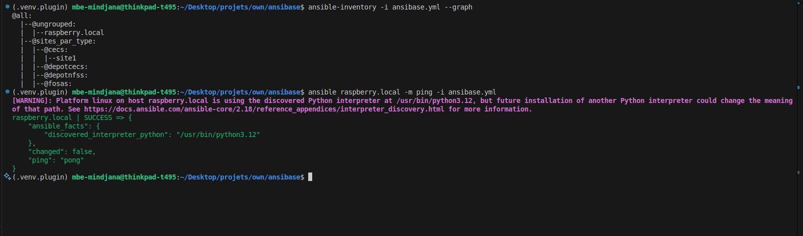

# ansibase

Systeme d'inventaire dynamique pour Ansible adosse a PostgreSQL, avec une API REST pour la gestion centralisee des hotes, groupes, variables et leurs relations. Supporte le chiffrement des variables sensibles via pgcrypto et l'aliasing de variables.

## Composants

| Composant                                  | Description                                                                                                        |
| ------------------------------------------ | ------------------------------------------------------------------------------------------------------------------ |
| [`packages/ansibase/`](packages/ansibase/) | Package Python core : constructeur d'inventaire, ORM, chiffrement pgcrypto, hierarchie de groupes, CLI, migrations |
| [`api/`](api/)                             | API REST FastAPI : CRUD hotes/groupes/variables, export inventaire, auth par cle API, audit                        |

Trois commandes CLI :

- **`ansibase-manage`** : gestion des hotes, groupes et variables (CRUD + import YAML)
- **`ansibase-db`** : migrations de base de donnees (Alembic)
- **`ansibase-inventory`** : script d'inventaire dynamique pour Ansible

## Prerequis

- **Python** 3.12+
- **PostgreSQL** 12+ avec `pgcrypto`
- **Ansible** 2.18+ — optionnel, uniquement pour l'integration Ansible

## Demarrage rapide

### Avec Docker (recommande)

```bash
git clone https://github.com/MbeHenri/ansibase.git && cd ansibase
cp api/.env.example .env
# Editer .env (ANSIBLE_ENCRYPTION_KEY, ANSIBASE_SECRET_KEY)
docker compose up --build
```

L'API est accessible sur `http://localhost:8000` ([Swagger](http://localhost:8000/docs)).

### En local

```bash
# Environnement
python3 -m venv .venv && source .venv/bin/activate

# Package core + support Ansible
pip install -e "packages/ansibase[ansible]"

# API
pip install -r api/requirements.txt
cp api/.env.example api/.env
# Editer api/.env

# Base de donnees
sudo -u postgres createdb -O ansibase ansibase
ansibase-db upgrade head
cd api && python3 manage-db.py upgrade head && cd ..

# Lancer l'API
cd api && uvicorn app.main:app --reload --host 0.0.0.0 --port 8000
```

## CLI de gestion (`ansibase-manage`)

Gestion des hotes, groupes et variables depuis le terminal. Necessite un fichier de configuration (`ansibase.ini` ou `ansibase.yml`).

```bash
ansibase-manage -c ansibase.ini host list
ansibase-manage --json group list --tree
```

### Commandes disponibles

**Hotes** (`host`) : `list`, `show`, `create`, `update`, `delete`, `add-group`, `remove-group`, `set-var`, `unset-var`, `import`

**Groupes** (`group`) : `list`, `show`, `create`, `update`, `delete`, `set-var`, `unset-var`, `import`

**Variables** (`var`) : `list`, `create`, `update`, `delete`

> `<ref>` accepte un ID numerique ou un nom. Aide detaillee : `ansibase-manage host --help`

### Import YAML

```bash
# Importer des hotes avec leurs variables
ansibase-manage host import hosts.yml

# Importer un inventaire Ansible (groupes + hotes + variables)
ansibase-manage group import inventory.yml

# Simulation sans modification
ansibase-manage host import hosts.yml --dry-run
```

<details>
<summary>Exemples de fichiers YAML</summary>

**Import d'hotes** — format plat (un hote, hostname deduit du nom de fichier) :

```yaml
# web01.yml
ansible_host: 192.168.1.10
ansible_user: deploy
```

**Import d'hotes** — format multi-hotes :

```yaml
# hosts.yml
web01.example.com:
  ansible_host: 192.168.1.10
  ansible_user: deploy
web02.example.com:
  ansible_host: 192.168.1.11
  ansible_user: deploy
```

**Import de groupes** — format inventaire Ansible :

```yaml
# inventory.yml
webservers:
  hosts:
    web01.example.com:
      ansible_host: 192.168.1.10
  vars:
    http_port: 80
  children:
    frontend:
      hosts:
        web01.example.com:
```

</details>

## API REST

Documentation interactive : [Swagger UI](http://localhost:8000/docs) | [ReDoc](http://localhost:8000/redoc)

> Voir [`api/README.md`](api/README.md) pour la liste complete des endpoints.

```bash
# Obtenir une cle API
curl -X POST http://localhost:8000/api/v1/auth/login \
  -H "Content-Type: application/json" \
  -d '{"username": "admin", "password": "admin"}'

# Utiliser l'API
curl -H "Authorization: Bearer <api_key>" http://localhost:8000/api/v1/hosts
curl -H "Authorization: Bearer <api_key>" http://localhost:8000/api/v1/inventory
```

### Endpoints principaux

| Ressource     | Endpoint                  | Description                         |
| ------------- | ------------------------- | ----------------------------------- |
| **Auth**      | `POST /api/v1/auth/login` | Connexion, retourne la cle API      |
| **Hosts**     | `/api/v1/hosts`           | CRUD hotes, groupes et variables    |
| **Groups**    | `/api/v1/groups`          | CRUD groupes, variables, hierarchie |
| **Variables** | `/api/v1/variables`       | Catalogue de variables et alias     |
| **Inventory** | `GET /api/v1/inventory`   | Export inventaire (format Ansible)  |
| **Users**     | `/api/v1/users`           | Gestion des utilisateurs et cles    |
| **Audit**     | `GET /api/v1/audit-logs`  | Journaux d'audit (superuser)        |

> Les identifiants acceptent un ID numerique ou un nom. Pagination : `?page=1&per_page=50`

## Integration Ansible

### Mode plugin (`ansibase_ansible`)

Configuration dans `ansible.cfg` (deja fourni) :

```ini
[defaults]
inventory_plugins = packages/ansibase/src/ansibase/ansible

[inventory]
enable_plugins = ansibase_ansible, auto, yaml, ini
```

```bash
cp example.ansibase.yml ansibase.yml
# Editer ansibase.yml avec les parametres de connexion

ansible-inventory -i ansibase.yml --list
ansible-inventory -i ansibase.yml --graph
ansible all -i ansibase.yml -m ping
```



### Mode script (`ansibase-inventory`)

```bash
cp example.ansibase.ini ansibase.ini
# Editer ansibase.ini

ansibase-inventory --list
ansibase-inventory --list --pretty
ansibase-inventory --host mon-serveur
```

## Licence

Ce projet est distribue sous licence [GPL-3.0](LICENSE).
