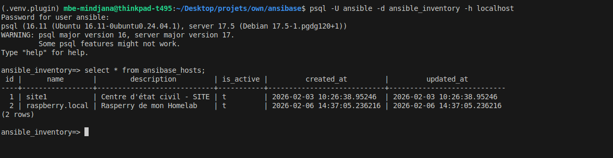

# ansibase

Systeme d'inventaire dynamique pour Ansible adosse a PostgreSQL. Il permet de centraliser la gestion des hotes, groupes, variables et leurs relations dans une base de donnees, avec support du chiffrement des variables sensibles via pgcrypto et de l'aliasing de variables.

Deux modes d'integration avec Ansible sont disponibles :

- **Mode plugin** : plugin d'inventaire Ansible (`ansibase_plugin.py`)
- **Mode script** : script d'inventaire dynamique (`inventory.ansibase.py`)

## Structure du projet

```txt
.
├── ansibase/                       # package Python principal
│   ├── __init__.py                   # + point d'entree du package (exports publics)
│   ├── builder.py                    # + construction de l'inventaire Ansible
│   ├── crypto.py                     # + chiffrement/dechiffrement via pgcrypto
│   ├── database.py                   # + connexion et gestion de la base de donnees
│   ├── graph.py                      # + arborescence hierarchique des groupes
│   ├── requirements.txt              # + dependances du package seul
│   ├── models/                       # + modeles ORM (SQLAlchemy)
│   │   ├── __init__.py
│   │   ├── base.py                     # - modele de base
│   │   ├── group.py                    # - modele des groupes
│   │   ├── host.py                     # - modele des hotes
│   │   └── variable.py                 # - modele des variables et alias
│   └── schemas/                      # + schemas SQL
│       ├── init.sql                    # - creation du schema ansibase
│       └── roolback.init.sql           # - suppression du schema ansibase
├── plugins/                        # utilitaires d'integration Ansible
│   └── ansibase_plugin.py           # + plugin d'inventaire Ansible
├── inventory.ansibase.py           # script d'inventaire dynamique
├── ansible.cfg                     # configuration Ansible (activation du plugin)
├── example.ansibase.yml            # configuration d'exemple pour le plugin
├── example.ansibase.ini            # configuration d'exemple pour le script
└── requirements.txt                # dependances completes (package + utils)
```

## Prerequis

- **Python** 3.12+
- **PostgreSQL** 12+ avec l'extension `pgcrypto`
- **psql** (client PostgreSQL) pour initialiser le schema

Pour le mode plugin uniquement :

- **Ansible** 2.18+ (`ansible-core`)

## Installation

### 1. Cloner le depot

```bash
git clone <url-du-depot> ansibase
cd ansibase
```

### 2. Creer un environnement virtuel

```bash
python3 -m venv .venv
source .venv/bin/activate
```

### 3. Installer les dependances

**Package seul** (pour une utilisation en tant que bibliotheque Python, ou avec le script d'inventaire) :

```bash
pip install -r ansibase/requirements.txt
```

**Package + utilitaires Ansible** (plugin et script d'inventaire) :

```bash
pip install -r requirements.txt
```

Cela installe en plus les dependances Ansible (`ansible`, `ansible-core`, etc.) necessaires au fonctionnement du plugin d'inventaire.

### 4. Initialiser la base de donnees

Creer la base de donnees et l'utilisateur PostgreSQL si ce n'est pas deja fait :

```bash
sudo -u postgres createuser --pwprompt ansible
sudo -u postgres createdb -O ansible ansible_inventory
```

Puis initialiser le schema ansibase :

```bash
psql -U ansible -d ansible_inventory -f ansibase/schemas/init.sql
```

Cela cree les tables, index, triggers, vues et insere les donnees par defaut (groupes `all` et `ungrouped`, variables Ansible builtin).

Pour supprimer le schema (rollback) :

```bash
psql -U ansible -d ansible_inventory -f ansibase/schemas/roolback.init.sql
```

### 5. Configurer les fichiers

Copier les fichiers de configuration d'exemple et les adapter :

```bash
# Pour le mode script
cp example.ansibase.ini ansibase.ini

# Pour le mode plugin
cp example.ansibase.yml ansibase.yml
```

Editer chaque fichier avec les vrais parametres de connexion a la base de donnees et la cle de chiffrement.

## Utilisation

### Mode script (`inventory.ansibase.py`)

Le script d'inventaire est un executable autonome qui retourne un JSON compatible avec le protocole d'inventaire dynamique d'Ansible. Il utilise un fichier de configuration INI (`ansibase.ini`).

**Lister l'inventaire complet :**

```bash
./inventory.ansibase.py --list
```

**Afficher le JSON de maniere lisible :**

```bash
./inventory.ansibase.py --list --pretty
```

**Recuperer les variables d'un hote specifique :**

```bash
./inventory.ansibase.py --host mon-serveur
```

**Utiliser un fichier de configuration personnalise :**

```bash
./inventory.ansibase.py --list --config /chemin/vers/custom.ini
```

**Utiliser le script avec une commande Ansible :**

```bash
# Ping de tous les hotes
ansible all -i inventory.ansibase.py -m ping

# Executer une commande sur un groupe
ansible webservers -i inventory.ansibase.py -m shell -a "uptime"

# Lancer un playbook
ansible-playbook -i inventory.ansibase.py site.yml
```

### Mode plugin (`ansibase_plugin.py`)

Le plugin s'integre nativement dans le systeme de plugins d'Ansible. Il necessite un fichier de configuration YAML (`ansibase.yml`) et que le plugin soit active dans `ansible.cfg`.

**Configuration de `ansible.cfg`** (deja fourni dans le depot) :

```ini
[defaults]
inventory_plugins = ./plugins

[inventory]
enable_plugins = ansibase_plugin, auto, yaml, ini
```

**Configuration de `ansibase.yml`** :

```yaml
plugin: ansibase_plugin

host: localhost
port: 5432
database: ansible_inventory
user: ansible
password: "mot_de_passe"

encryption_key: "cle_de_chiffrement"
```

> Le fichier doit se terminer par `ansibase.yml` ou `ansibase.yaml` pour etre reconnu par le plugin.

**Verifier que le plugin est reconnu :**

```bash
ansible-inventory -i ansibase.yml --list
```

**Afficher l'arborescence de l'inventaire :**

```bash
ansible-inventory -i ansibase.yml --graph
```

Exemple d'arborescence et de ping via le plugin :


**Utiliser le plugin avec une commande Ansible :**

```bash
# Ping de tous les hotes
ansible all -i ansibase.yml -m ping

# Recuperer les facts d'un groupe
ansible webservers -i ansibase.yml -m setup

# Lancer un playbook
ansible-playbook -i ansibase.yml deploy.yml

# Lancer un playbook avec limite sur un hote
ansible-playbook -i ansibase.yml deploy.yml --limit mon-serveur
```

### Ajouter des donnees dans la base

Vue des hotes avec psql :



Exemples d'insertion de donnees via `psql` :

```sql
-- Creer un groupe
INSERT INTO ansibase_groups (name, description, parent_id)
VALUES ('webservers', 'Serveurs web', (SELECT id FROM ansibase_groups WHERE name = 'all'));

-- Creer un hote
INSERT INTO ansibase_hosts (name, description)
VALUES ('web01.example.com', 'Serveur web principal');

-- Associer l'hote au groupe
INSERT INTO ansibase_host_groups (host_id, group_id)
VALUES (
    (SELECT id FROM ansibase_hosts WHERE name = 'web01.example.com'),
    (SELECT id FROM ansibase_groups WHERE name = 'webservers')
);

-- Definir une variable non sensible pour l'hote
INSERT INTO ansibase_host_variables (host_id, var_id, var_value)
VALUES (
    (SELECT id FROM ansibase_hosts WHERE name = 'web01.example.com'),
    (SELECT id FROM ansibase_variables WHERE var_key = 'ansible_host'),
    '192.168.1.10'
);

INSERT INTO ansibase_host_variables (host_id, var_id, var_value)
VALUES (
    (SELECT id FROM ansibase_hosts WHERE name = 'raspberry.local'),
    (SELECT id FROM ansibase_variables WHERE var_key = 'ansible_user'),
    'mbecode'
);

-- Definir une variable sensible chiffree pour l'hote
INSERT INTO ansibase_host_variables (host_id, var_id, var_value_encrypted)
VALUES (
    (SELECT id FROM ansibase_hosts WHERE name = 'web01.example.com'),
    (SELECT id FROM ansibase_variables WHERE var_key = 'ansible_password'),
    pgp_sym_encrypt('mot_de_passe_ssh', 'cle_de_chiffrement')
);
```

**Consulter le catalogue des variables avec leurs alias :**

```sql
SELECT * FROM ansibase_v_variables_catalog;
```
